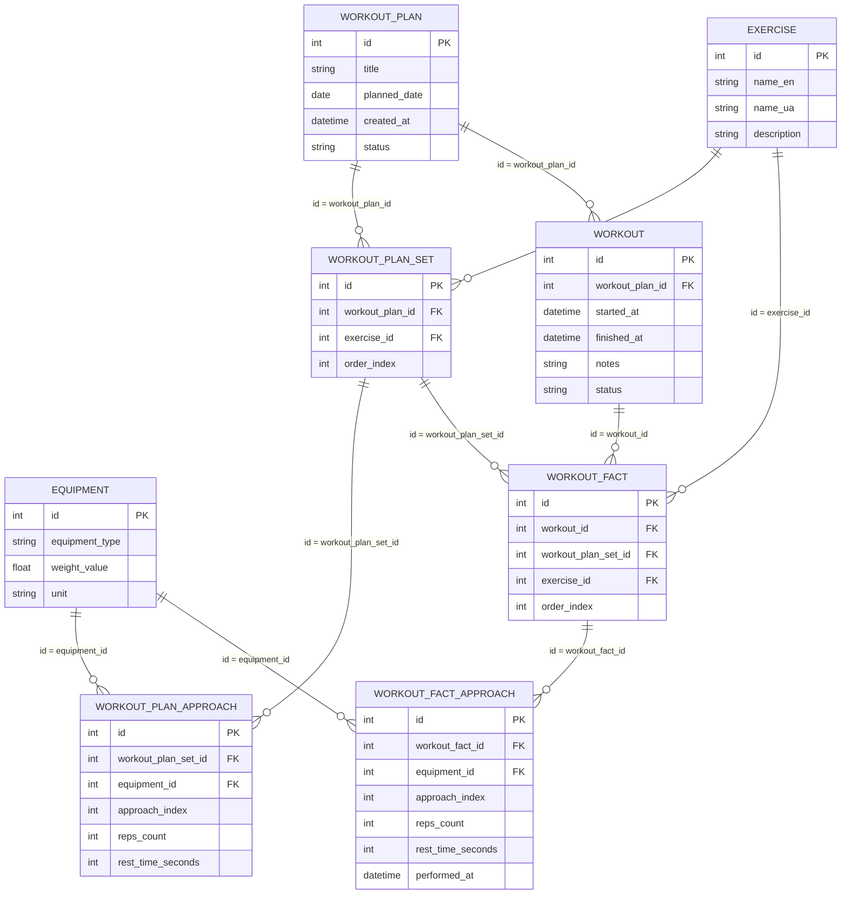

## Оновлено: лаконічні підписи на лініях

```mermaid
erDiagram
    EXERCISE {
        int id PK
        string name_en
        string name_ua
        string description
    }
    EQUIPMENT {
        int id PK
        string equipment_type
        float weight_value
        string unit
    }
    WORKOUT_PLAN {
        int id PK
        string title
        date planned_date
        datetime created_at
        string status
    }
    WORKOUT_PLAN_SET {
        int id PK
        int workout_plan_id FK
        int exercise_id FK
        int order_index
    }
    WORKOUT_PLAN_APPROACH {
        int id PK
        int workout_plan_set_id FK
        int equipment_id FK
        int approach_index
        int reps_count
        int rest_time_seconds
    }
    WORKOUT {
        int id PK
        int workout_plan_id FK
        datetime started_at
        datetime finished_at
        string notes
        string status
    }
    WORKOUT_FACT {
        int id PK
        int workout_id FK
        int workout_plan_set_id FK
        int exercise_id FK
        int order_index
    }
    WORKOUT_FACT_APPROACH {
        int id PK
        int workout_fact_id FK
        int equipment_id FK
        int approach_index
        int reps_count
        int rest_time_seconds
        datetime performed_at
    }

    WORKOUT_PLAN ||--o{ WORKOUT_PLAN_SET : "id = workout_plan_id"
    EXERCISE ||--o{ WORKOUT_PLAN_SET : "id = exercise_id"
    WORKOUT_PLAN_SET ||--o{ WORKOUT_PLAN_APPROACH : "id = workout_plan_set_id"
    EQUIPMENT ||--o{ WORKOUT_PLAN_APPROACH : "id = equipment_id"

    WORKOUT_PLAN ||--o{ WORKOUT : "id = workout_plan_id"
    WORKOUT ||--o{ WORKOUT_FACT : "id = workout_id"
    WORKOUT_PLAN_SET ||--o{ WORKOUT_FACT : "id = workout_plan_set_id"
    EXERCISE ||--o{ WORKOUT_FACT : "id = exercise_id"
    WORKOUT_FACT ||--o{ WORKOUT_FACT_APPROACH : "id = workout_fact_id"
    EQUIPMENT ||--o{ WORKOUT_FACT_APPROACH : "id = equipment_id"
```

